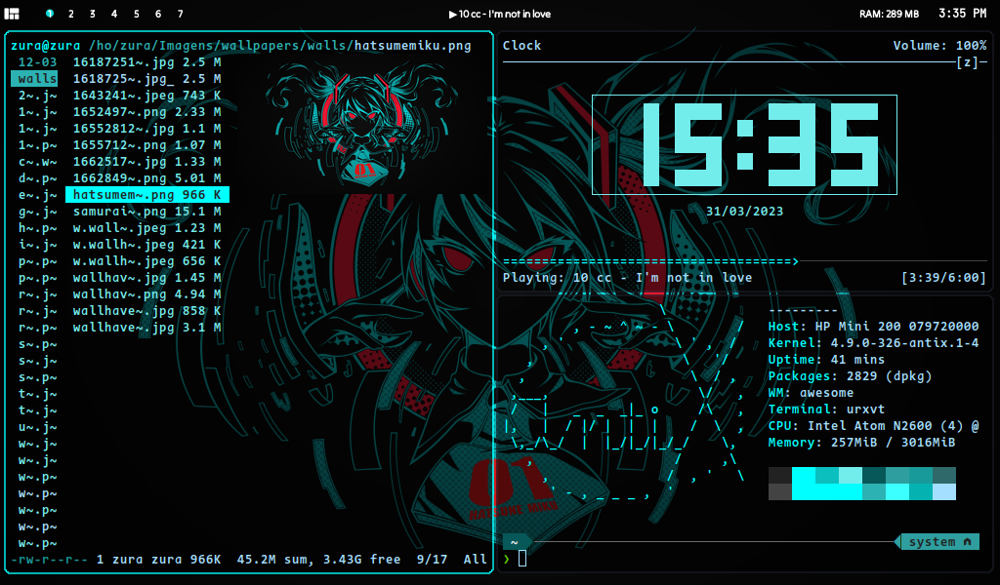
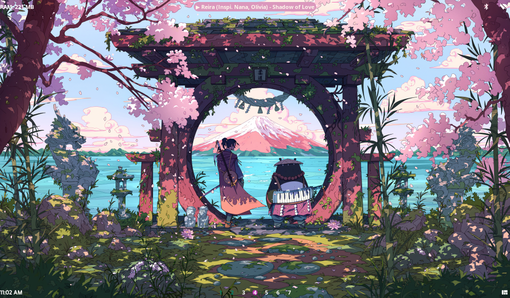
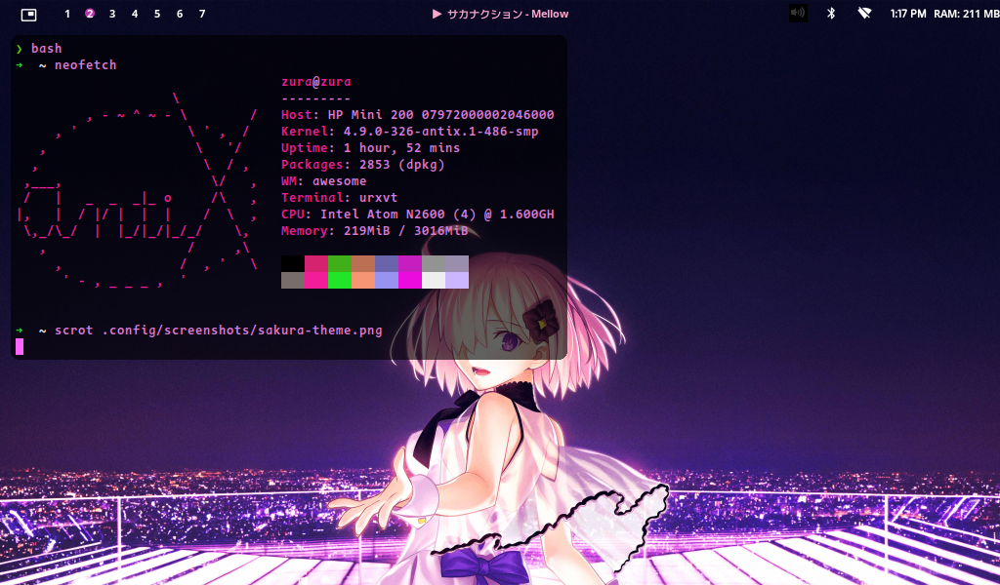
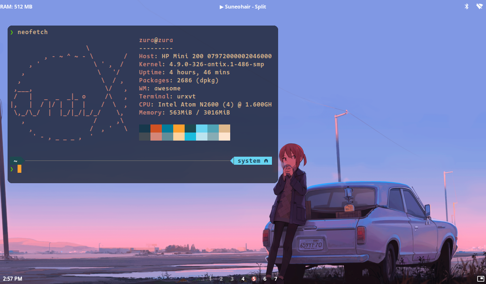
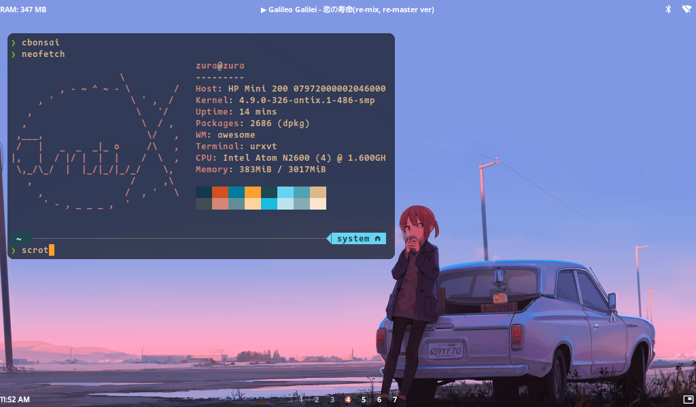
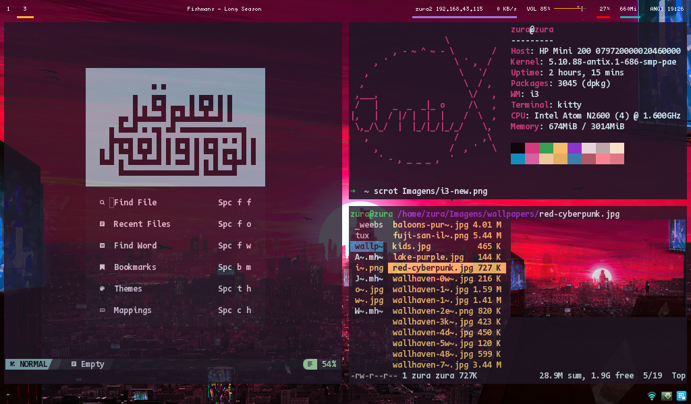
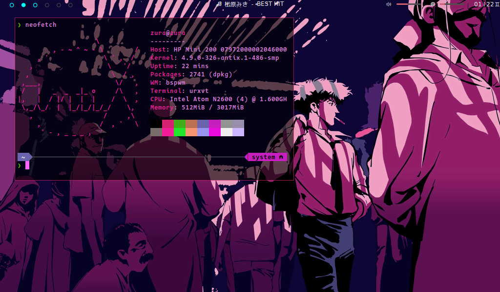

# My dotfiles
So i don't have to rewrite whenever changing distro. 

## Awesome WM dotfiles

My first take on "ricing". I drew inspirations from [here](https://github.com/WillPower3309/awesome-dotfiles), and [here](https://github.com/anhsirk0/awesome-config/)

### Requirements
 - awesome wm (> v4.3)
 - picom 
 - mpd + mpc or playerctl (for current song widget)[Optional]
 - polybar (for norm theme)

## i3 dotfiles

### Requirements
 - picom
 - polybar
 - mpd + mpc
 - feh (background setter)

## Bspwm dotfiles

### Requirements
 - picom
 - [eww widgets](https://elkowar.github.io/eww)
 - nitrogen (bg setter)
 - polybar
