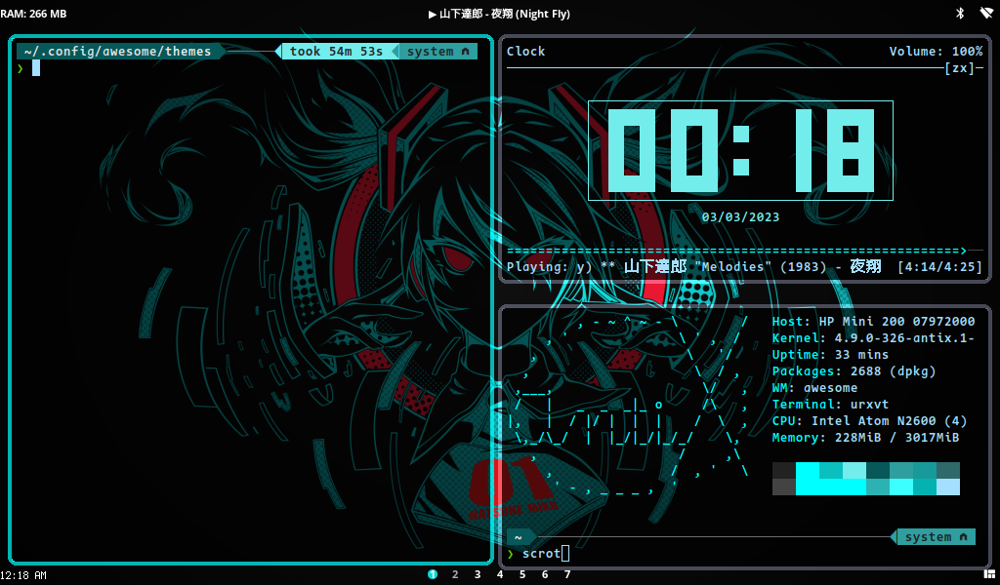
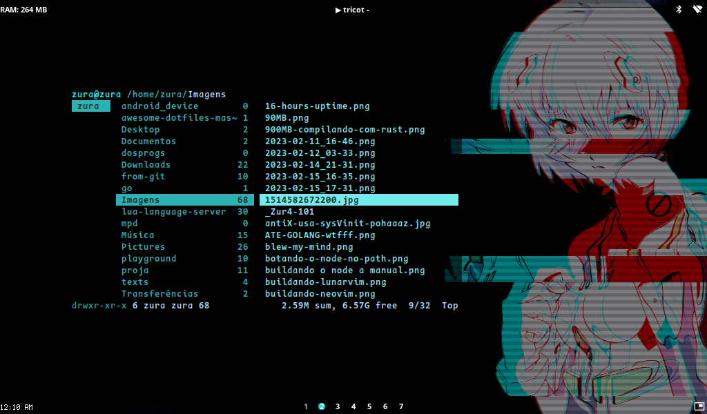
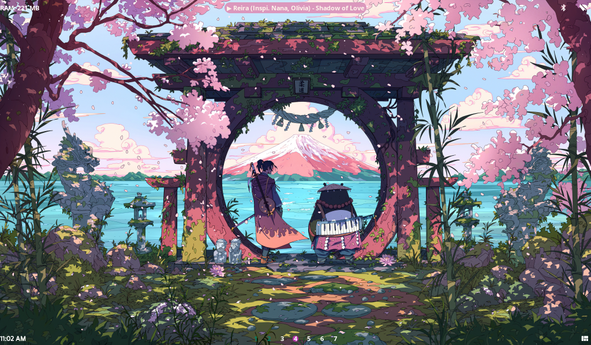
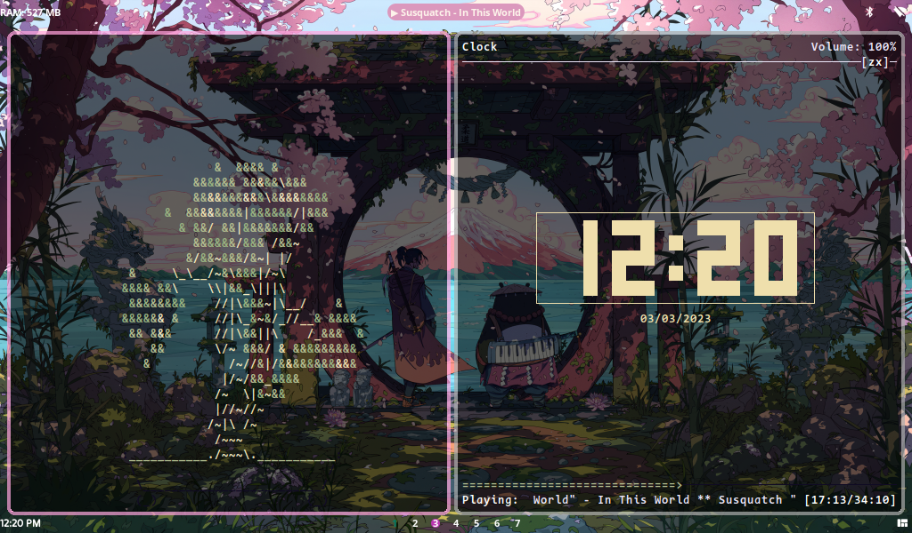
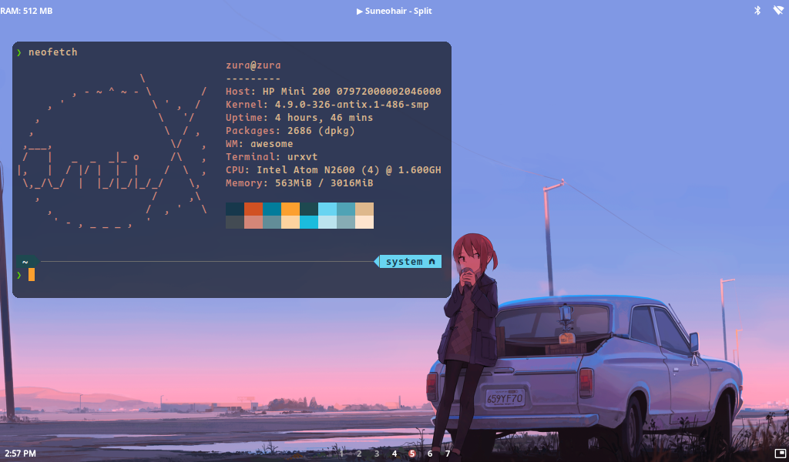
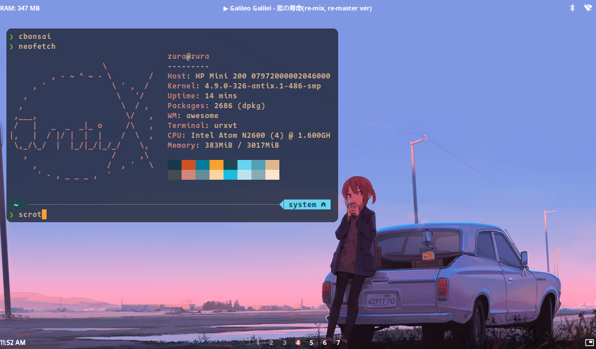

# My Awesome WM dotfiles

My first take on "ricing". I drew inspirations from [here]("https://github.com/WillPower3309/awesome-dotfiles"), and [here](https://github.com/anhsirk0/awesome-config/)

## Requirements
 -awesome wm (> v4.3)
 -picom 
 -mpd + mpc or playerctl (for current song widget)[Optional] 

